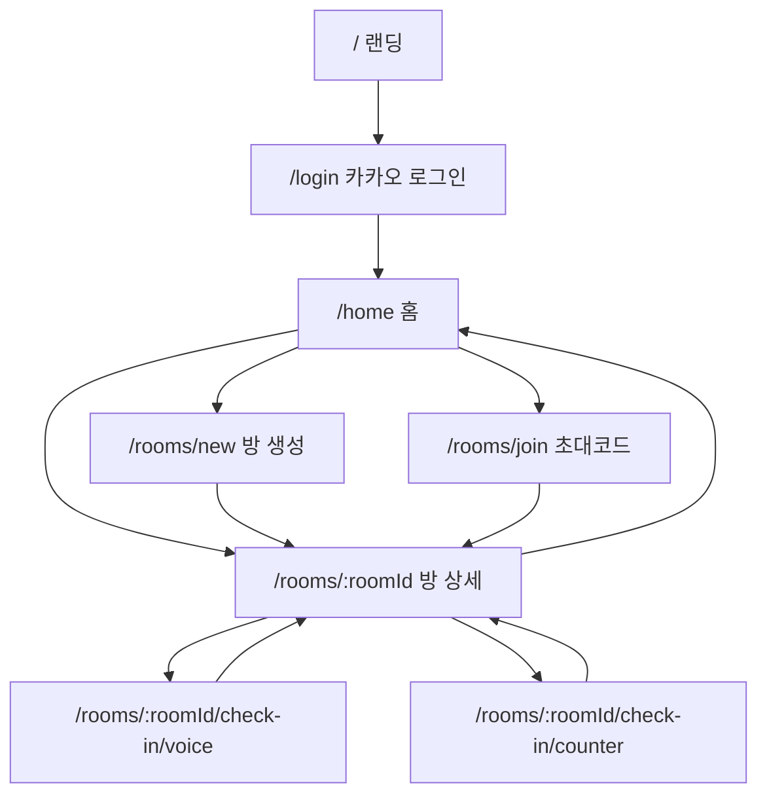

# 말씀암송 인증방 PWA — 화면 흐름

> [`DB_SPEC.md`](./DB_SPEC.md)의 7개 테이블 구조를 기준으로 작성.  
> MVP 이후 화면은 별도 표시하며 현재 구현 범위에 포함하지 않는다.

---

## 화면 목록 (MVP)

| # | 화면 | 경로 (제안) |
|---|------|-------------|
| 1 | 랜딩페이지 | `/` |
| 2 | 카카오 로그인 | `/login` |
| 3 | 홈 | `/home` |
| 4 | 암송방 생성 | `/rooms/new` |
| 5 | 초대코드 입장 | `/rooms/join` |
| 6 | 암송방 상세 | `/rooms/:roomId` |
| 7 | 녹음 인증 | `/rooms/:roomId/check-in/voice` |
| 8 | 계수기 인증 | `/rooms/:roomId/check-in/counter` |
| 13 | 통계 (MVP 이후) | `/rooms/:roomId/stats` |

> 7~12번은 6번(암송방 상세) 내부 영역 또는 하위 화면으로 구성.

---

## 1. 랜딩페이지

### 화면 목적
비로그인 사용자에게 서비스를 소개하고 카카오 로그인으로 유도한다.

### 사용자가 보는 요소
- 서비스 로고·이름
- 핵심 메시지: *「함께 말씀을 암송하고, 매일 인증하며, 서로 아멘으로 격려하는 암송방」*
- 기능 소개 (암송·매일 인증·아멘 격려·함께하는 방)
- 「카카오로 시작하기」CTA 버튼

### 사용자가 할 수 있는 행동
- 스크롤하여 소개 확인
- 「카카오로 시작하기」탭 → 로그인 화면 이동

### 연결 DB 테이블
- 없음 (정적 페이지)

### Mock data
- 불필요

### 다음 화면
- **카카오 로그인** (`/login`)
- **로그인 상태**에서 `/` 접근 시 → **홈** (`/home`) 자동 리다이렉트

---

## 2. 카카오 로그인 화면

### 화면 목적
카카오 OAuth로 식별하고, 앱에서 사용할 실명을 받아 회원 등록·로그인한다.

### 사용자가 보는 요소
- 카카오 로그인 버튼
- 실명 입력 필드 (`NAME`)
- (선택) 프로필 이미지 미리보기 (`PROFILE_IMG`)

### 사용자가 할 수 있는 행동
- 카카오 로그인 (mock: 버튼 클릭 → mock 사용자 선택)
- 실명 입력·확인
- `KAKAO_ID` 기준 기존 회원 조회 → 있으면 로그인, 없으면 `TB_MEMBER` INSERT

### 연결 DB 테이블
| 테이블 | 용도 |
|--------|------|
| `TB_MEMBER` | 조회·등록 (`KAKAO_ID`, `PROFILE_IMG`, `NAME`, `ROLE=MEMBER`, `STATUS=Y`) |

### Mock data 구조
```typescript
interface MockMember {
  memberId: number;
  kakaoId: string;
  profileImg: string | null;
  name: string;
  role: 'ADMIN' | 'MEMBER';
  status: 'Y' | 'N';
}
```

### 다음 화면
- **홈** (`/home`)
- **로그인 상태**에서 `/login` 접근 시 → **홈** (`/home`) 자동 리다이렉트

---

## 3. 홈 화면

### 화면 목적
로그인 사용자가 참여 중인 암송방 목록을 보고, 새 방 생성·입장·방 상세로 이동한다.

### 사용자가 보는 요소
- 사용자 이름·프로필 (`TB_MEMBER`)
- 참여 중인 암송방 카드 목록
  - 방 이름 (`ROOM_NAME`)
  - 오늘 내 인증 상태 뱃지 (`TB_RECITATION_CHECK_IN.STATUS`, 오늘 날짜)
- 「암송방 만들기」「초대코드로 입장」버튼

### 사용자가 할 수 있는 행동
- 암송방 카드 탭 → 방 상세
- 암송방 만들기 → 생성 화면
- 초대코드 입장 → 입장 화면

### 연결 DB 테이블
| 테이블 | 용도 |
|--------|------|
| `TB_MEMBER` | 현재 사용자 |
| `TB_ROOM` | 방 정보 |
| `TB_ROOM_MEMBER` | 참여 방 필터 (`STATUS='Y'`) |
| `TB_RECITATION_CHECK_IN` | 방별 오늘 인증 상태 |

### Mock data 구조
```typescript
interface HomeRoomCard {
  roomId: number;
  roomName: string;
  inviteCode: string;
  memberCount: number;
  memberLimit: number;
  todayCheckInStatus: 'Y' | 'N' | null; // null = row 없음 → 미완료
}
```

### 다음 화면
- **암송방 생성** (`/rooms/new`)
- **초대코드 입장** (`/rooms/join`)
- **암송방 상세** (`/rooms/:roomId`)

---

## 4. 암송방 생성 화면

### 화면 목적
새 암송방을 만들고 생성자를 방장으로 등록한다.

### 사용자가 보는 요소
- 방 이름 입력 (`ROOM_NAME`)
- 참여 인원 제한 입력 (`MEMBER_LIMIT`, 1~20)
- 생성 버튼

### 사용자가 할 수 있는 행동
- 방 이름·인원 제한 입력
- 생성 → `TB_ROOM` INSERT + `TB_ROOM_MEMBER` INSERT (`ROOM_ROLE='LEADER'`)

### 연결 DB 테이블
| 테이블 | 용도 |
|--------|------|
| `TB_ROOM` | INSERT (`LEADER_ID`, `INVITE_CODE` 자동 생성, `STATUS='Y'`) |
| `TB_ROOM_MEMBER` | INSERT (생성자, `ROOM_ROLE='LEADER'`) |
| `TB_MEMBER` | 현재 사용자 `MEMBER_ID` |

### Mock data 구조
```typescript
interface CreateRoomInput {
  roomName: string;
  memberLimit: number; // 1~20
}
// 생성 결과: TB_ROOM + TB_ROOM_MEMBER row
```

### `INVITE_CODE` 생성 (MVP 확정)

| 항목 | 규칙 |
|------|------|
| 형식 | 6자리 대문자 영문 + 숫자 |
| 예시 | `A7K3P9` |
| mock | 기존 코드와 중복 여부만 확인 |
| 백엔드 | UNIQUE 중복 검증은 추후 처리 |

### 다음 화면
- **암송방 상세** (`/rooms/:roomId`) — 생성 직후 이동

---

## 5. 초대코드 입장 화면

### 화면 목적
초대코드로 기존 암송방에 참여한다.

### 사용자가 보는 요소
- 초대코드 입력 필드 (6자리 대문자 영문+숫자, 예: `A7K3P9`)
- 입장 버튼
- (선택) 입장 실패 메시지 (코드 없음, 인원 초과, 이미 참여 중, 방 비활성)

### 사용자가 할 수 있는 행동
- `INVITE_CODE` 입력
- 입장 시도:
  1. `TB_ROOM` 조회 (`STATUS='Y'`)
  2. 참여자 수 < `MEMBER_LIMIT` 확인
  3. 중복 참여 확인 (`TB_ROOM_MEMBER`)
  4. `TB_ROOM_MEMBER` INSERT (`ROOM_ROLE='MEMBER'`)

### 연결 DB 테이블
| 테이블 | 용도 |
|--------|------|
| `TB_ROOM` | `INVITE_CODE` 조회 |
| `TB_ROOM_MEMBER` | 참여자 수·중복 확인, INSERT |

### Mock data 구조
```typescript
interface JoinRoomInput {
  inviteCode: string;
}
```

### 다음 화면
- 성공 → **암송방 상세** (`/rooms/:roomId`)
- 실패 → 현재 화면 유지 + 에러 메시지

---

## 6. 암송방 상세 화면

### 화면 목적
암송방의 핵심 허브. 말씀 확인, 오늘 인증, 인증 피드, 아멘을 한곳에서 처리한다.

### 사용자가 보는 요소
- 방 이름·초대코드 (방장: 공유 가능)
- **암송 본문/공지 영역** (섹션 7) — 전원 조회
- **방장 전용 본문 등록/수정 영역** (섹션 7) — `ROOM_ROLE = 'LEADER'`만 표시
- **오늘 인증 상태 영역** (섹션 8)
- **날짜별/사람별 인증 피드** (섹션 11) — `STATUS='Y'` 카드만

### 사용자가 할 수 있는 행동
- 암송 말씀 읽기
- (방장) 본문/공지 등록·수정 — 별도 관리자 페이지 없이 방 상세 내 간단 UI
- 오늘 인증하기 (녹음/계수기)
- 피드 스크롤·아멘
- 뒤로 → 홈

### 연결 DB 테이블
| 테이블 | 용도 |
|--------|------|
| `TB_ROOM` | 방 정보 |
| `TB_ROOM_MEMBER` | 참여자 목록 |
| `TB_MEMBER` | 참여자 프로필 |
| `TB_RECITATION_SECTION` | 암송 본문 |
| `TB_RECITATION_CHECK_IN` | 인증 카드·오늘 상태 |
| `TB_RECITATION_CHECK_IN_DETAIL` | detail 목록 |
| `TB_RECITATION_AMEN` | 아멘 |

### Mock data
- [`MOCK_DATA_GUIDE.md`](./MOCK_DATA_GUIDE.md) 전체 피드 구조 참조

### 다음 화면
- **녹음 인증** (`/rooms/:roomId/check-in/voice`)
- **계수기 인증** (`/rooms/:roomId/check-in/counter`)
- **홈** (뒤로)

---

## 7. 암송 본문/공지 영역 (방 상세 내)

### 화면 목적
현재 암송 중인 말씀을 표시하고, 방장이 본문/공지를 등록·수정한다. (인증 대상 안내)

> **MVP 포함.** 별도 관리자 페이지 없이 방 상세 안에 간단한 등록/수정 UI로 처리.

### 사용자가 보는 요소 (전원)
- 섹션 제목 (`SECTION_TITLE`)
- 암송 범위 (`WEEKLY_RANGE`)
- 말씀 본문 (`RECITATION_TEXT`)
- `IS_ACTIVE='Y'` 섹션 강조

### 사용자가 보는 요소 (방장 전용)
- 「본문 등록」「수정」버튼 또는 접을 수 있는 폼
- 입력: `SECTION_TITLE`, `WEEKLY_RANGE`, `RECITATION_TEXT`, `DISPLAY_ORDER`, `IS_ACTIVE`
- 표시 조건: `TB_ROOM_MEMBER.ROOM_ROLE = 'LEADER'` (프론트 UI + 추후 백엔드 권한 검증)

### 사용자가 할 수 있는 행동
- (전원) 본문 읽기·스크롤
- (방장) 본문/공지 등록 — `TB_RECITATION_SECTION` INSERT
- (방장) 기존 섹션 수정 — `TB_RECITATION_SECTION` UPDATE

### 연결 DB 테이블
| 테이블 | 용도 |
|--------|------|
| `TB_RECITATION_SECTION` | 조회·등록·수정 |
| `TB_ROOM_MEMBER` | 방장 여부 (`ROOM_ROLE = 'LEADER'`) |

### Mock data 구조
```typescript
interface RecitationSection {
  sectionId: number;
  roomId: number;
  sectionTitle: string;
  weeklyRange: string;
  recitationText: string;
  displayOrder: number;
  isActive: 'Y' | 'N';
  status: 'Y' | 'N';
}

interface CreateSectionInput {
  sectionTitle: string;
  weeklyRange: string;
  recitationText: string;
  displayOrder: number;
  isActive: 'Y' | 'N';
}
```

### 다음 화면
- 방 상세 내 고정 (별도 라우트 불필요)

---

## 8. 오늘 인증 상태 영역 (방 상세·홈 내)

### 화면 목적
오늘 내 인증 완료/미완료를 명확히 보여주고 인증 CTA를 제공한다.

### 사용자가 보는 요소
- 상태 뱃지: ✅ 완료 / ⭕ 미완료
- (완료 시) 오늘 등록한 detail 요약 (선택)
- 「녹음 인증」「계수기 인증」버튼

### 사용자가 할 수 있는 행동
- 인증 방식 선택 → 해당 인증 화면 이동

### 연결 DB 테이블
| 테이블 | 용도 |
|--------|------|
| `TB_RECITATION_CHECK_IN` | `CHECK_IN_DATE = 오늘`, `STATUS` 조회 |

### 판단 기준
| 조회 결과 | UI |
|-----------|-----|
| row 없음 | 미완료 |
| `STATUS='N'` | 미완료 |
| `STATUS='Y'` | 완료 |

### Mock data
```typescript
interface TodayCheckInStatus {
  checkInId: number | null;
  status: 'Y' | 'N' | null;
}
```

### 다음 화면
- **녹음 인증** / **계수기 인증**

---

## 9. 녹음 인증 화면

### 화면 목적
음성 녹음으로 암송 인증 detail을 추가한다.

### 사용자가 보는 요소
- 녹음 시작/정지 버튼
- 녹음 시간·파형 (선택)
- 미리듣기
- 전송 버튼

### 사용자가 할 수 있는 행동
- 녹음 → 전송:
  1. 오늘 `TB_RECITATION_CHECK_IN` 조회/생성
  2. `TB_RECITATION_CHECK_IN_DETAIL` INSERT (`CHECK_IN_TYPE='VOICE'`, `AUDIO_URL`)
  3. 부모 `STATUS='Y'` 갱신
- (본인 detail) 취소 → `STATUS='N'`, 부모 STATUS 재계산

### 연결 DB 테이블
| 테이블 | 용도 |
|--------|------|
| `TB_RECITATION_CHECK_IN` | 조회/생성 |
| `TB_RECITATION_CHECK_IN_DETAIL` | INSERT (`VOICE`, `AUDIO_URL`) |

### Mock data
```typescript
interface VoiceCheckInDetail {
  detailId: number;
  checkInId: number;
  checkInType: 'VOICE';
  audioUrl: string;
  counterValue: null;
  createdAt: string;
  status: 'Y' | 'N';
}
```

### 다음 화면
- 전송 완료 → **암송방 상세** (피드에 반영)

---

## 10. 계수기 인증 화면

### 화면 목적
암송 횟수(계수)로 인증 detail을 추가한다.

### 사용자가 보는 요소
- 숫자 입력 / +/- 버튼
- 전송 버튼

### 사용자가 할 수 있는 행동
- 횟수 입력 → 전송:
  1. 오늘 CHECK_IN 조회/생성
  2. DETAIL INSERT (`CHECK_IN_TYPE='COUNTER'`, `COUNTER_VALUE`)
  3. 부모 `STATUS='Y'`

### 연결 DB 테이블
| 테이블 | 용도 |
|--------|------|
| `TB_RECITATION_CHECK_IN` | 조회/생성 |
| `TB_RECITATION_CHECK_IN_DETAIL` | INSERT (`COUNTER`, `COUNTER_VALUE`) |

### Mock data
```typescript
interface CounterCheckInDetail {
  detailId: number;
  checkInId: number;
  checkInType: 'COUNTER';
  audioUrl: null;
  counterValue: number;
  createdAt: string;
  status: 'Y' | 'N';
}
```

### 다음 화면
- **암송방 상세**

---

## 11. 날짜별/사람별 인증 피드 (방 상세 내)

### 화면 목적
방 참여자들의 날짜별·사람별 인증 기록을 피드 형태로 보여준다.

### 노출·정렬 규칙 (MVP 확정)

| 규칙 | 내용 |
|------|------|
| 노출 대상 | `TB_RECITATION_CHECK_IN.STATUS = 'Y'` 카드만 |
| 미노출 | `STATUS = 'N'` 카드 — 피드에 표시하지 않음 |
| 날짜 정렬 | **최신 날짜가 위** |
| 같은 날짜 내 | MVP mock 기준 자연스러운 표시 |

> `STATUS = 'N'`은 오늘 인증 미완료 표시(섹션 8) 등 내부 상태용. 피드와 혼동하지 않는다.

### 사용자가 보는 요소
- 날짜 구분선 (`CHECK_IN_DATE`, 최신순)
- 사람별 카드 (`CHECK_IN_ID` + `MEMBER` 프로필·이름)
- 카드 내 detail 목록 (녹음 🎙️ / 계수기 🔢 + 시간)
- 아멘 수 + 아멘 버튼

### 사용자가 할 수 있는 행동
- 피드 스크롤
- (본인 detail) 취소
- (타인 카드) 아멘 토글

### 연결 DB 테이블
| 테이블 | 용도 |
|--------|------|
| `TB_RECITATION_CHECK_IN` | `STATUS='Y'` 카드만 |
| `TB_RECITATION_CHECK_IN_DETAIL` | `STATUS='Y'` detail |
| `TB_MEMBER` | 작성자 정보 |
| `TB_RECITATION_AMEN` | 아멘 수·내 아멘 여부 |

### Mock data
- [`MOCK_DATA_GUIDE.md`](./MOCK_DATA_GUIDE.md) — `FeedByDate[]` (날짜 내림차순)

### 다음 화면
- **아멘 UI** (카드 내 인라인, 별도 화면 없음)

---

## 12. 아멘 UI (피드 카드 내)

### 화면 목적
다른 참여자의 하루 인증 카드에 격려(아멘)를 남긴다.

### 사용자가 보는 요소
- `🙏 아멘 {count}`
- 아멘 버튼 (눌림/해제 상태)

### 사용자가 할 수 있는 행동
- 아멘 토글:
  - 대상 `CHECK_IN_ID`의 `MEMBER_ID` ≠ 본인
  - `TB_RECITATION_AMEN` INSERT 또는 `STATUS` 토글

### 연결 DB 테이블
| 테이블 | 용도 |
|--------|------|
| `TB_RECITATION_AMEN` | INSERT/UPDATE |
| `TB_RECITATION_CHECK_IN` | 대상 카드·작성자 확인 |

### Mock data
```typescript
interface AmenState {
  amenCount: number;
  isAmenedByMe: boolean;
}
```

### 다음 화면
- 없음 (인라인 토글)

---

## 13. MVP 이후 — 통계 화면

> **현재 구현 범위 아님**

### 화면 목적
개인·방 단위 암송 참여 통계를 보여준다.

### 표시 가능 항목 (PDF 기준)
- 개인 이번 달 인증일 수
- 개인 연속 인증일 수
- 방 오늘/최근 7일 참여율
- 회원별 인증 횟수

### 연결 DB 테이블
- `TB_RECITATION_CHECK_IN` (`STATUS='Y'` 기준)
- `TB_ROOM_MEMBER` (`STATUS='Y'` 기준)
- 별도 통계 테이블 없음

---

## 인증·리다이렉트 규칙 (MVP 확정)

| 조건 | 동작 |
|------|------|
| 로그인 상태 + `/` 또는 `/login` 접근 | `/home`으로 리다이렉트 |
| 비로그인 + protected route 접근 | `/login`으로 리다이렉트 |

Protected routes: `/home`, `/rooms/new`, `/rooms/join`, `/rooms/:roomId`, `/rooms/:roomId/check-in/*`

---

## 전체 네비게이션 다이어그램



---

## 인증 전송 공통 플로우 (9·10 공통)

```
1. ROOM_ID, MEMBER_ID, 오늘 날짜로 CHECK_IN 조회
2. 없으면 INSERT (CHECK_IN_DATE=TRUNC(오늘), STATUS='Y')
3. 있으면 기존 CHECK_IN_ID 사용
4. DETAIL INSERT
5. 부모 CHECK_IN.STATUS = 'Y' 갱신
→ 트랜잭션
```

## 인증 취소 공통 플로우

```
1. DETAIL STATUS='N', DELETED_AT 설정
2. 같은 CHECK_IN_ID 아래 STATUS='Y' detail 존재 확인
3. 있으면 부모 STATUS='Y', 없으면 STATUS='N'
→ 트랜잭션
```
